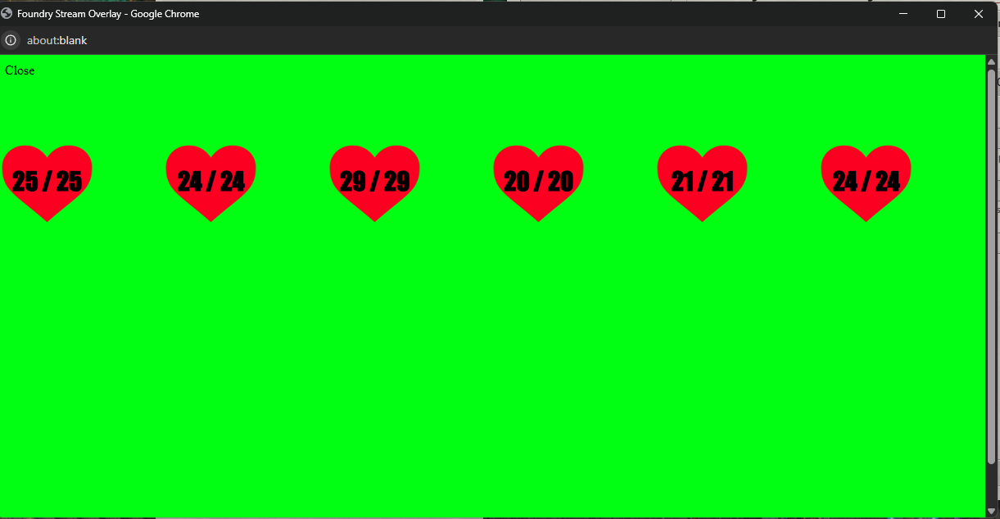
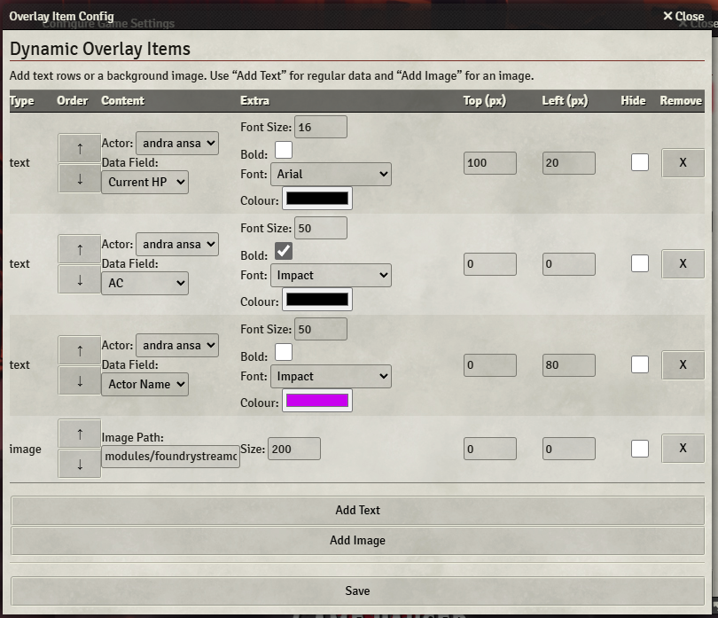
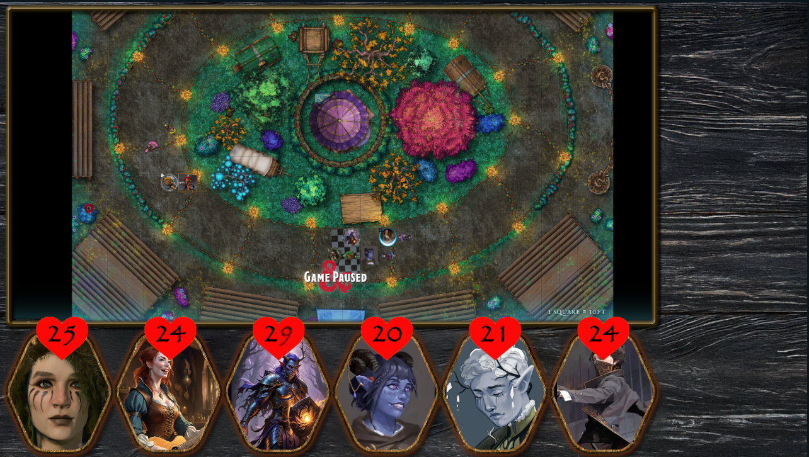

# Foundry Stream Overlay

**Foundry Stream Overlay** is a module for [Foundry VTT](https://foundryvtt.com/) that provides a green-screen pop-up showing your players’ hit points (HP), names, and more, ready to be captured in a streaming setup. Ideal for broadcasting active character stats in a neat overlay on Twitch, YouTube, etc.

## Purpose

- Displays each player-owned character’s current HP (and optionally max HP) in a separate pop-up window.  
- Offers a background colour (chroma key) so you can layer it over your stream.  
- Lets you arrange each character’s display **and** tweak style options (fonts, bold text, heart icons).  
- Works with a single click or a “Manual Open” button.  
- Helps you keep your audience informed about the party’s status without exposing the entire Foundry screen.



## Features

1. **Configurable HP paths** – supports systems that store HP differently (e.g. `attributes.hp.value`).
2. **Per-actor layout** – easily position each actor’s stats or hide them.
3. **Visual customisation** – change font sizes, colours, and select from a range of built-in font families.
4. **Add images and reorder them!
5. **Green-screen background** – set any colour, but default is `#00ff00` for easy chroma keying.
## Usage
1. **Add Actors**
   - Add adctors to your world, all the dnd stuff will be updated
2. **Open Overlay**  
   - Under **Module Settings**, there’s an “Open Overlay Window” option. Click that to pop up the overlay in a new window.  
   - Or call the `openOverlayWindow()` function from the console.
3. **Stream Setup**  
   - Capture that pop-up in OBS (or similar) as a browser/window source.  
   - Apply a **chroma key** filter matching the background colour (default green).
4. **Live Updates**  
   - Whenever HP changes or you move the layout, the overlay refreshes automatically.





## Setup

1. Open **Game Settings** (the cog icon in Foundry).
2. Go to **Module Settings** → **Configure Layout**.
3. In “Actor Positions,” set each character’s `Top` and `Left` to position them. Check “Hide?” if you want to hide them entirely.
4. In “Display Options,” choose whether to show names, max HP, and so on.
5. In “Heart Icon Options,” toggle `Show Heart Icon`, select an image, adjust its `Size`, and use the `Heart Text Offset` slider to move the text up or down over the icon.

## Installation

   - Copy and paste the following link into Foundry’s **Install Module** prompt:  
     ```
     https://raw.githubusercontent.com/darkjenso/FoundryStreamOverlay/refs/heads/main/module.json
     ```
   - Then click **Install**. 


   - You can close and reopen if needed.

