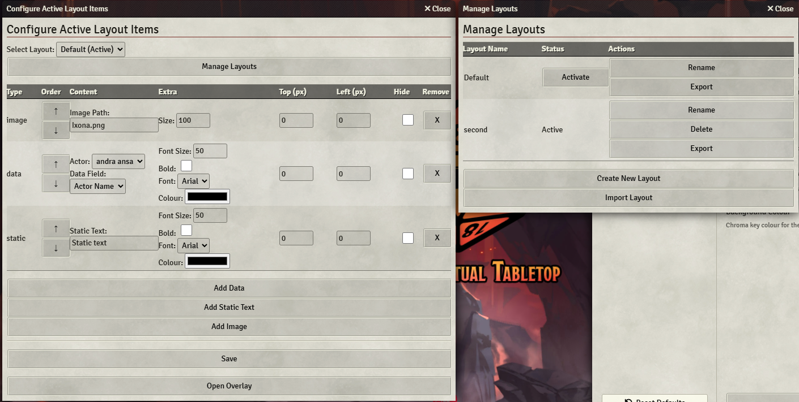

# Foundry Stream Overlay

**Foundry Stream Overlay** is a module for [Foundry VTT](https://foundryvtt.com/) that provides a customizable overlay pop-up for streaming. It displays live character data (like hit points, names, and more) in a green‑screen window that can be captured in OBS, Twitch, YouTube, etc.

## Purpose

- **Live Data Display:**  
  Displays player-owned characters’ current data (e.g. HP, AC, level, etc.) in a separate pop‑out window for streaming setups.

- **Chroma Key Background:**  
  Uses a configurable background colour (default is `#00ff00`) for easy chroma keying.

- **Dynamic Layout Management:**  
  Includes a layout manager that lets you save multiple overlay layouts, import/export layouts, and change the active layout on the fly. This means you can create different arrangements (including static text elements and animated items) and switch between them instantly without restarting your stream.

- **Macro Support:**  
  Easily change active layouts with a simple macro.

- **Custom Visuals & Animations:**  
  Offers a variety of visual customisation options—adjust fonts, sizes, colours, and add animations (like bounce or glitch effects) to individual overlay items.


## Features

1. **Configurable Data Fields:**  
   Supports different game systems by allowing you to set custom data paths (e.g. `system.attributes.hp.value`).

2. **Multiple Layouts:**  
   Create, rename, delete, import, and export overlay layouts with the built-in layout manager. Switch between layouts instantly via the configuration window or a macro.

3. **Animation Options:**  
   Add animations to overlay items via a dropdown in the configuration. Options include "None", "Bounce", "Glitch", and more as you add your custom CSS animations.

4. **Macro Integration:**  
   Use a provided macro snippet to change the active layout instantly without needing to navigate the settings.

5. **Chroma Key Ready:**  
   The default green background (`#00ff00`) makes it simple to use a chroma key filter in your streaming software.


## Usage

1. **Assign Player Actors**  
   Ensure players have actors assigned to them so that their data appears on the overlay.

2. **Open the Overlay Window**  
   Under **Module Settings**, click “Open Overlay Window” (or run the provided macro) to open a separate pop‑out window with your overlay.

3. **Configure Layout & Visuals**  
   - In the **Configure Overlay Items** window, add or remove data rows, static text, or images.
   - Use the new layout manager to create multiple layouts and switch between them instantly.



4. **Stream Setup**  
   - Capture the overlay window in OBS (or similar) as a browser or window source.
   - Apply a chroma key filter matching the background colour to make it transparent.

5. **Live Updates**  
   The overlay updates automatically when data changes or when you change the active layout.

## Installation

- Open **Foundry VTT** and navigate to **Add-on Modules**.
- Click **Install Module** and paste the following URL:
- https://raw.githubusercontent.com/darkjenso/FoundryStreamOverlay/refs/heads/main/module.json
- Click **Install** and restart Foundry if needed.

## Macro Example

Use the following macro to change active layouts instantly:

```
// Replace "MyLayoutName" with the layout you wish to activate.
let newLayout = "MyLayoutName";
game.settings.set("foundrystreamoverlay", "activeLayout", newLayout)
.then(() => {
  ui.notifications.info(`Active layout set to ${newLayout}`);
  if (window.foundryStreamOverlayApp) {
    window.foundryStreamOverlayApp.render();
  }
})
.catch(err => console.error("Failed to set active layout:", err));
```
